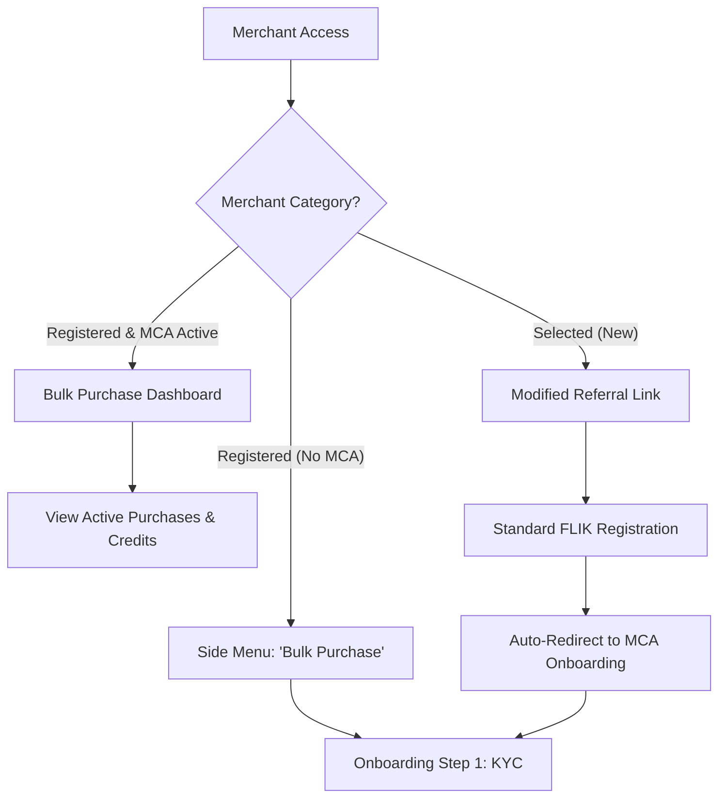
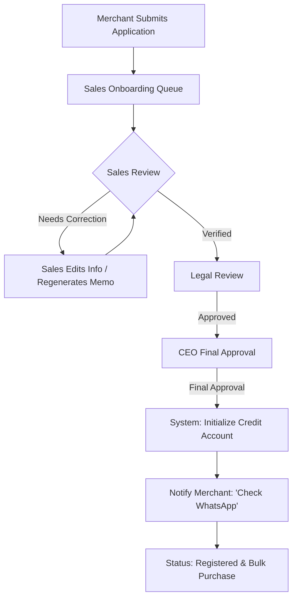
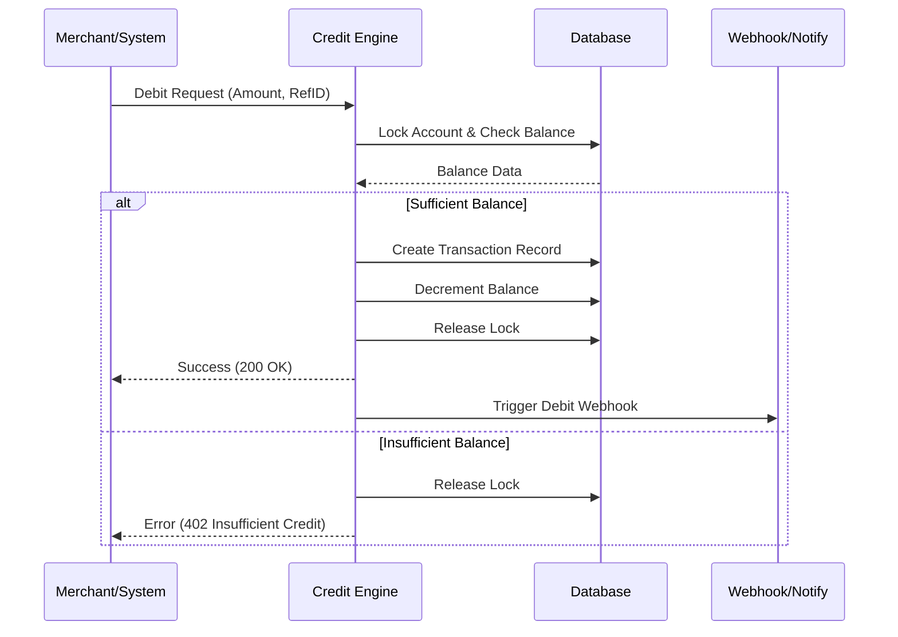
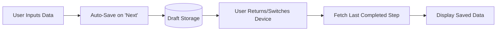

# MCA Credit Engine & Automated Onboarding: Final PRD

## 1. Overview
**Product Name:** MCA Credit Engine (Backend + Merchant & Internal Dashboards)  
**Objective:**  
To automate the end-to-end merchant onboarding process for the Merchant Cash Advance (MCA) "Bulk Purchase" program and provide a robust system for managing, allocating, and tracking credits. This system replaces manual coordination between Sales, Legal, and Executive teams with a streamlined digital workflow.

**Business Goals:**
*   **Reduce Onboarding Time:** Automate document submission and approval workflows to decrease time-to-live.
*   **Operational Efficiency:** Replace manual email/chat approvals with a centralized internal dashboard.
*   **Scalable Credit Management:** Provide real-time tracking, allocation, and reconciliation of merchant credits.
*   **Auditability & Transparency:** Maintain an immutable trail of approvals and credit utilization for compliance.

---

## 2. Problem & Mission
**Current State:**
*   **Manual Onboarding:** Handled via fragmented coordination (WhatsApp/Email), leading to bottlenecks and zero status visibility for merchants.
*   **Error-Prone Tracking:** Credit allocations and usage are tracked in silos, making reconciliation difficult.
*   **No Self-Service:** Merchants cannot view their balances or transaction history independently.

**Mission:**
Build a unified "MCA Credit Engine" that automates onboarding through a 5-step self-service wizard, provides internal tools for multi-stage approval, and manages the lifecycle of merchant credits with high precision.

---

## 3. Target Users
| Persona | Description | Motivation |
| :--- | :--- | :--- |
| **Merchant Partner** | Business owner joining the MCA program | Fast onboarding and real-time visibility into credit balances. |
| **Sales Team** | Internal team managing relationships | Efficiently move applications through the pipeline and manage merchant info. |
| **Legal / CEO** | Final approvers for agreements | A "one-click" interface to review documents and grant final approval. |
| **Finance Team** | Internal financial controllers | Accurate usage reports, audit trails, and reconciliation tools. |
| **System Integrator** | Backend developers | Reliable APIs and clear documentation for credit operations. |

---

## 4. Merchant Categories & Access Logic
Merchants are divided into three distinct categories, each with a specific entry point and behavior:

### A. Registered FLIK Merchant
*   **Definition:** Merchants already active on the FLIK Dashboard but not yet in the MCA program.
*   **Access:** Can initiate registration for the MCA/Bulk Purchase program via the **"Bulk Purchase"** option in the side menu.
*   **Behavior:** Clicking the menu triggers the Onboarding Wizard (Step 1).

### B. Registered FLIK Merchant & Bulk Purchase
*   **Definition:** Merchants who have successfully completed onboarding and are active in the MCA program.
*   **Access:** Direct access to the **Bulk Purchase** dashboard.
*   **Behavior:** Can view their active bulk purchase list, credit balances, and transaction history.

### C. Selected Merchant (Pre-Registration)
*   **Definition:** Prospective merchants not yet registered on the FLIK Dashboard.
*   **Access:** Receive a **modified/referral link** from the Sales team.
*   **Behavior:** 
    1.  Link directs them to the standard FLIK Merchant Registration page.
    2.  Upon successful registration, the system **automatically redirects** them to the Bulk Purchase onboarding flow.

---

## 5. The Merchant Onboarding Journey (5-Step Flow)
The onboarding process is designed to be asynchronous with "Save & Resume" capabilities.

### Step 1: Identity Verification
*   **Data Points:** KTP Direktur, NPWP Direktur, KTP Owner.
*   **System Logic:** Automated KYC check. If the uploaded KTP does not match the CLIK account data, the user is blocked.
*   **Auto-Save:** Progress is saved and a draft application is created only after a successful KYC match.

### Step 2: Funding Request
*   **Data Points:** Requested Amount (IDR), Tenor (Days), Business Age, Revenue Channels (#), Est. Gross Margin (%).
*   **Save Point:** User can "Save & Exit" to consult stakeholders on loan parameters.

### Step 3: Channel Integration (High Friction)
*   **Link Channels:** Offline, GoFood, GrabFood, ShopeeFood, Tokopedia, Shopee, TikTok Shop, Lazada, Blibli.
*   **Revenue Data:** Monthly revenue for the last 6 months + Payment method screenshots.
*   **Save Point:** Progress is saved per channel linked and per screenshot uploaded.

### Step 4: Legal Documents
*   **Documents:** AKTA (Pendirian & Perubahan), SK Kemenkumham, NIB, NPWP PT.
*   **Save Point:** Allows switching from mobile (for photos) to desktop (for PDF uploads).

### Step 5: Financial Statements
*   **Documents:** Bank Statement, P&L (Last Month), Balance Sheet (Last Month).
*   **CLIK Agreement:** Downloadable consent form; must be signed and re-uploaded.
*   **Final Save:** Data validation occurs before the final "Submit" action.

---

## 6. Core Features

### 6.1 Merchant Dashboard (Self-Service)
*   **Conditional Entry:** Redirects unregistered merchants to the Onboarding Wizard; registered merchants see the Bulk Purchase list.
*   **Waiting & Status Page:** Real-time tracking (e.g., "Waiting for Assessment") and post-assessment instructions ("Check WhatsApp").
*   **Credit Overview:** Real-time balance display and usage charts.
*   **Transaction History:** Searchable list of all credit debits and allocations.

### 6.2 Internal Dashboard (Sales & Admin)
*   **Onboarding Queue:** Centralized view of pending applications.
*   **Merchant Info Manager:** View/edit submitted documents and regenerate `memo.pdf` if data is updated.
*   **Approval Workflow:** Multi-stage toggle: **Sales Review → Legal Review → CEO Approval**.
*   **Credit Management:** Interface for manual allocation, adjustments, and bulk operations.

### 6.3 Backend / Credit Engine
*   **Automated Provisioning:** Initializes credit accounts upon final CEO approval.
*   **Transaction Ledger:** High-concurrency engine for debiting/crediting balances with transaction locking.
*   **Webhook System:** Notifies merchant systems of balance changes or status updates.
*   **Audit Log:** Immutable record of all dashboard actions and system transactions.

---

## 7. Technical Architecture

### 7.1 System Flow
1.  **Onboarding:** Merchant completes 5-step flow → Application enters Internal Queue.
2.  **Review:** Sales verifies info → Legal reviews docs → CEO grants final approval.
3.  **Provisioning:** System transitions merchant to "Registered" status and initializes `CreditAccount`.
4.  **Allocation:** Admin allocates credits → `CreditTransaction` logged → Balance updated.
5.  **Usage:** Merchant performs transaction → System validates balance → Credit debited.

### 7.2 Core Data Model
*   **Merchant:** `{id, name, registration_status, kyc_data, created_at}`
*   **CreditAccount:** `{id, merchant_id, balance, currency, tier_id, updated_at}`
*   **CreditTransaction:** `{id, account_id, type (allocate/debit/adjust), amount, reference_id, metadata}`
*   **AuditLog:** `{id, action, performed_by, timestamp, changes}`

### 7.3 API Interface
*   `allocateCredit(merchantId, amount, reference)`
*   `debitCredit(merchantId, amount, reference)`
*   `getBalance(merchantId)`
*   `getTransactions(merchantId, filters)`

---

## 8. Security & Compliance
*   **RBAC:** Strict separation between Sales (edit), Legal (review), and CEO (approve).
*   **Data Encryption:** KYC and Legal documents encrypted at rest (AES-256) and in transit (TLS 1.3).
*   **Audit Trail:** Immutable logs for all credit operations and status changes (SOX/PCI DSS alignment).
*   **Concurrency Control:** Transaction locking to prevent race conditions on balance updates.

---

## 9. Analytics & KPIs
*   **Onboarding Velocity:** Average time from "Step 1" to "Final Approval."
*   **Conversion Rate:** % of merchants who start vs. complete the 5-step flow.
*   **Credit Utilization:** Ratio of allocated vs. used credits per merchant/tier.
*   **Reconciliation Accuracy:** Rate of discrepancies between allocations and usage.

---

## 10. Risks & Mitigations
| Risk | Impact | Mitigation |
| :--- | :--- | :--- |
| **Document Quality** | Medium | Frontend validation for file types/sizes; Sales "Edit" capability. |
| **Race Conditions** | High | Implement database-level transaction locking. |
| **Manual Contact Delays** | Medium | Automated Slack/Email alerts to internal teams upon submission. |
---

## 11. Detailed User Flows

### 11.1 Merchant Entry & Routing Flow
This flow visualizes how different merchant categories access the MCA program based on their registration status.

### 11.2 Internal Approval & Provisioning Workflow
The multi-stage approval process required to transition a merchant from "Applicant" to "Active MCA Partner."

### 11.3 Credit Debit Transaction (Backend Logic)
The sequence of operations performed by the Credit Engine when a merchant utilizes their credits.

### 11.4 Save & Resume Logic
Ensuring data persistence across sessions and devices during the high-friction onboarding process.

