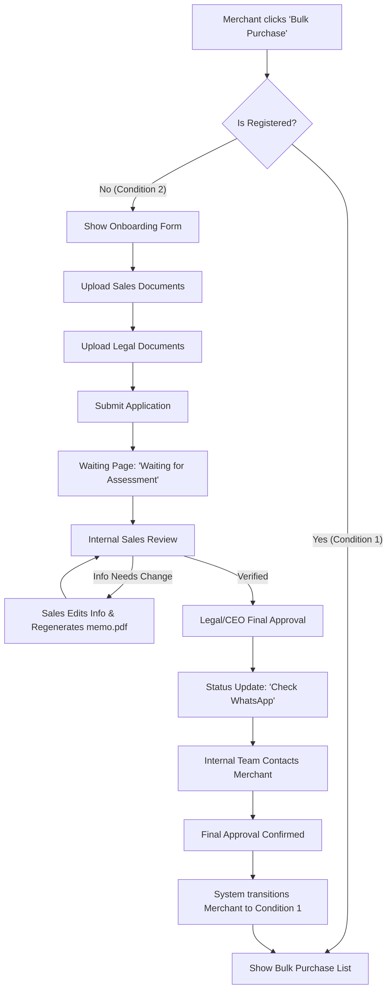

## **MCA Credit Engine & Automated Onboarding**

### **1. Overview**

**Product name:** MCA Credit Engine (Backend + Merchant & Internal Dashboards)  
**Objective:**  
Automate the end-to-end merchant onboarding process for the "Bulk Purchase" program. This system replaces manual coordination between Sales, Legal, and the CEO with a streamlined digital workflow for document submission, verification, and credit allocation.

**Business goals:**
* **Reduce Onboarding Time:** Decrease the time-to-live for new merchants by automating document submission and approval workflows.
* **Operational Efficiency:** Free up Sales, Legal, and Executive time by replacing manual email/chat approvals with a centralized dashboard.
* **Scalable Credit Management:** Provide real-time tracking, allocation, and reconciliation of merchant credits.
* **Auditability:** Maintain a clear, immutable trail of who approved which merchant and how credits are being utilized.

---

### **2. Problem & Mission**

**Current state:**
* **Manual Onboarding:** Merchant onboarding is handled via manual coordination between Sales, Legal, and the CEO, leading to bottlenecks and lack of status visibility.
* **Fragmented Tracking:** Credit allocations and usage are tracked manually or in silos, making reconciliation difficult and error-prone.
* **No Self-Service:** Merchants lack a dedicated interface to view their credit balances or transaction history.

**Mission:**  
Create a unified "MCA Credit Engine" that automates merchant onboarding through a self-service dashboard, provides Sales and Leadership with internal tools to review and approve applications, and manages the lifecycle of merchant credits with high precision and transparency.

---

### **3. Target Users**

| Persona | Description | Motivation |
| ----- | ----- | ----- |
| **Merchant Partner** | Business owner or admin joining the MCA program | Wants a fast, transparent onboarding experience and real-time visibility into credits. |
| **Sales Team** | Internal team managing merchant relationships | Needs to organize merchant info and move applications through the pipeline efficiently. |
| **Legal/CEO** | Final approvers for merchant agreements | Need a simple "one-click" interface to review documents and grant final approval. |
| **Finance Team** | Internal financial controllers | Require accurate usage reports and reconciliation tools for compliance. |

---

### **4. Core Features**

#### **Merchant Dashboard (Self-Service)**
* **Bulk Purchase Entry Point:** 
    * **Condition 1 (Registered):** Direct access to the Bulk Purchase list.
    * **Condition 2 (Unregistered):** Redirect to the Onboarding/Registration page.
* **Onboarding Wizard:** Digital form for document submission (Sales & Legal documents).
* **Waiting & Status Page:** 
    * Real-time status tracking (e.g., "Uploaded successfully, waiting for assessment").
    * Post-assessment instructions (e.g., "Check WhatsApp, internal team will get in touch").
* **Credit Overview:** Real-time balance display and usage charts (post-approval).
* **Transaction History:** Searchable list of all credit debits and allocations.

#### **Internal Dashboard (Sales & Admin)**
* **Onboarding Queue:** Centralized view of pending merchant applications.
* **Merchant Info Manager:** 
    * View all uploaded Sales and Legal documents.
    * Capability for Sales to edit/manage information.
    * **Memo Generator:** Ability to regenerate `memo.pdf` if information is updated.
* **Approval Workflow:** Multi-stage approval toggle (Sales Review → Legal Review → CEO Approval).
* **Credit Management:** Interface to manually allocate or adjust credits (with reason logging).

#### **Backend / Credit Engine**
* **Automated Provisioning:** Automatically initialize credit accounts and transition merchant to "Condition 1" upon final approval.
* **Transaction Ledger:** High-concurrency engine for debiting/crediting balances.
* **Webhook System:** Notify merchant systems of balance changes or approval status updates.
* **Audit Log:** Immutable record of all dashboard actions and system transactions.

---

### **5. User Flows**

#### **5.1 Merchant Onboarding & Access Flow**

#### **5.2 Document Requirements**

| Category | Document Type | Details |
| --- | --- | --- |
| **Sales Documents** | Omset 6 bulan terakhir | Screenshot per bulan |
| | Vol payment method 6 bulan terakhir | Screenshot per bulan |
| | Bank Statement | PDF/Image |
| | Laporan laba rugi | Bulan lalu |
| | Neraca keuangan | Bulan lalu |
| **Legal Documents** | AKTA | Pendirian & Perubahan |
| | NPWP PT | Document scan |
| | NIB | Document scan |
| | SK KEMENKUMHAM | Document scan |
| | KTP & NPWP Direktur | Document scan |
| | KTP Owner | Document scan (2 copies) |

---

### **6. Epics, Stories & Tasks**

#### **🧩 Epic 1: Merchant Access & Onboarding Wizard**
**Story 1.1:** As a Merchant, I want the system to recognize my registration status when I click "Bulk Purchase".
* FE Task: Implement conditional routing for Bulk Purchase menu.
* BE Task: Create `checkRegistrationStatus` API.

**Story 1.2:** As an Unregistered Merchant, I can upload my Sales and Legal documents.
* FE Task: Build multi-section upload form with validation for all required documents.
* BE Task: Implement secure S3 storage and metadata mapping for uploaded files.

**Story 1.3:** As a Merchant, I can see my application status on a waiting page.
* FE Task: Build waiting page with dynamic status messages and "Check WhatsApp" call-to-action.

#### **⚙️ Epic 2: Internal Management & Memo Generation**
**Story 2.1:** As a Sales member, I can manage and edit merchant-submitted information.
* FE Task: Build detailed merchant profile view in Internal Dashboard.
* BE Task: Implement update APIs for merchant profile data.

**Story 2.2:** As a Sales member, I can regenerate the memo PDF.
* BE Task: Integrate PDF generation service to create `memo.pdf` using updated merchant data.

#### **💳 Epic 3: MCA Credit Engine Core**
**Story 3.1:** As the system, I can transition a merchant to "Registered" status upon final approval.
* BE Task: Implement status transition logic and trigger credit account initialization.

---

### **7. Security & Compliance**
* **Role-Based Access (RBAC):** Strict separation between Sales (edit info) and CEO (approve).
* **Data Encryption:** All KYC/Legal documents encrypted at rest (AES-256).
* **Audit Trail:** Every status change, document edit, and credit movement logged.

---

### **8. Analytics & KPIs**
* **Onboarding Velocity:** Average time from "Submitted" to "Condition 1."
* **Document Rejection Rate:** Frequency of Sales team needing to edit/regenerate info.
* **Conversion Rate:** Percentage of unregistered merchants who complete onboarding.

---

### **9. Risks & Mitigations**
| Risk | Impact | Mitigation |
| ----- | ----- | ----- |
| Document Quality | Medium | Implement file type and size validation on the frontend. |
| Manual Contact Delay | Medium | Automated alerts to the internal team when assessment is finished. |
| Data Desync | High | Ensure `memo.pdf` is always generated from the latest DB state. |
